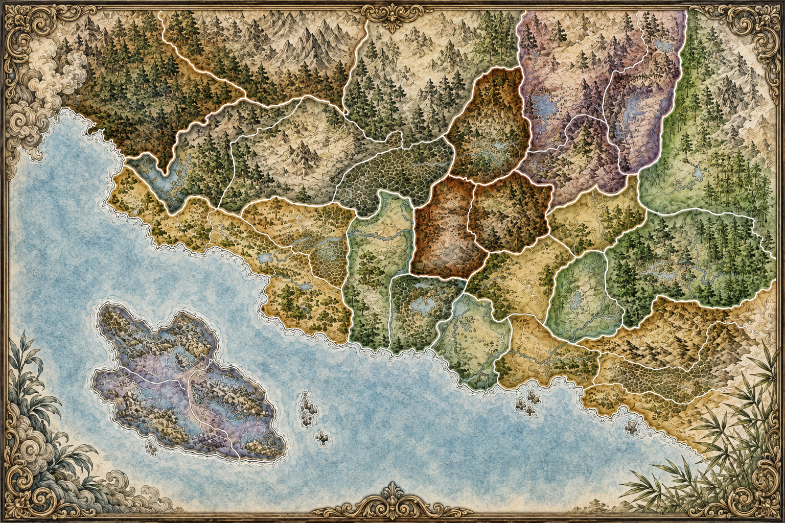

# Battle for Rokugan Online

  

  Браузерная версия настольной стратегии <b>«Битва за Рокуган»</b> для игры с друзьями.

  <a href="https://battle-for-rokugan-online.friendlygames.workers.dev/"><b>🎮 Играть онлайн</b></a>
  &nbsp;•&nbsp;
  <a href="./Rules-bitva-za-rokugan-rus.pdf"><b>📖 Правила игры в PDF</b></a>

> Проект находится в активной разработке. Некоторые правила, интерфейс и баланс ещё могут уточняться.

## Об игре

Великие кланы Рокугана сражаются за провинции, влияние и честь. Игроки тайно размещают приказы, атакуют соседние земли, защищают собственные владения, используют дипломатию, погромы, флот, синоби и особые способности своего клана.

Побеждает игрок, который к концу партии набрал больше всего чести за контролируемые провинции, регионы и выполненную тайную цель.

## Что уже доступно

- создание приватной игровой комнаты;
- подключение друзей по прямой ссылке или шестизначному коду комнаты;
- чат игроков как в лобби, так и непосредственно во время партии;
- добавление ботов, если не хватает живых игроков;
- выбор одного из семи Великих кланов Рокугана;
- уникальная способность и особый жетон каждого клана;
- тайные цели, размещение приказов, вскрытие и разрешение конфликтов;
- армии, флот, синоби, благословения, дипломатия, погромы и пустые жетоны;
- захват провинций, контроль регионов и итоговый подсчёт чести;
- журнал игровых событий и заметное уведомление о текущем ходе;
- фоновая музыка с отдельным проигрывателем;
- русский и английский язык интерфейса;
- восстановление комнаты и своей игровой сессии после обновления страницы.

## Как начать партию

1. Откройте [игру в браузере](https://battle-for-rokugan-online.friendlygames.workers.dev/).
2. Введите имя и создайте новую комнату.
3. Скопируйте ссылку приглашения и отправьте её друзьям. Также можно передать только код комнаты.
4. Каждый игрок выбирает свободный клан и подтверждает готовность.
5. Хозяин комнаты запускает партию.

Устанавливать игру или регистрировать аккаунт не требуется — достаточно современного браузера.

## Правила

Перед первой партией рекомендуется ознакомиться с [русскими правилами «Битвы за Рокуган»](./Rules-bitva-za-rokugan-rus.pdf).

Цель проекта — максимально близко воспроизвести настольную игру в удобном браузерном формате. Если поведение игры расходится с правилами, сообщите об этом как об ошибке.

## Предложения и сообщения об ошибках

Я открыт к **любым предложениям, идеям и исправлениям**.

Нашли ошибку, заметили неправильную реализацию правила или придумали улучшение — [создайте обращение в GitHub Issues](https://github.com/MORTEM3845/Battle-for-Rokugan-Online/issues/new). Можно писать в свободной форме: что произошло, что ожидалось и, по возможности, приложить скриншот.

Также приветствуются предложения по интерфейсу, игровому процессу, балансу ботов, карте, оформлению и новым возможностям.

## Статус проекта

Игра уже доступна онлайн, но продолжает развиваться. Возможны ошибки, незавершённые элементы и изменения сохранённых комнат после крупных обновлений.

## Важно

Это некоммерческий фанатский проект, созданный для игры с друзьями. Все права на оригинальную настольную игру, её мир, названия и материалы принадлежат их соответствующим правообладателям.
