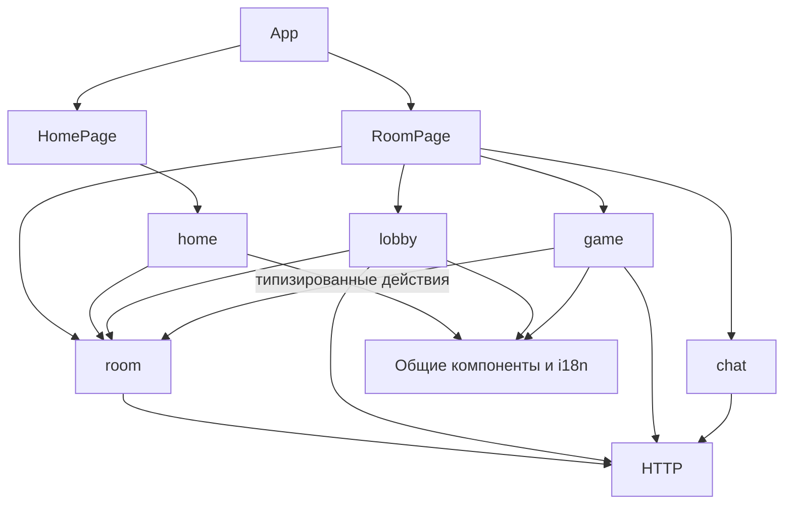

# Архитектурное ревью и первый этап рефакторинга

Дата: 27 сентября 2026.

## Вывод

Причина трудных изменений — пересечение обязанностей и отсутствие проверяемых границ модулей. Сам по себе React здесь не проблема. Уже есть удачные отдельные части: HTTP-клиент, чат, компоненты карты, панели игры, серверные функции лобби и подсчёта очков. Их следует развивать через композицию и небольшие интерфейсы.

Обзор охватывает структуру `src`, `shared`, `worker`, скрипты проверок и CI. Подробно разобраны создание и вход в комнату, сессия, опрос состояния, лобби, подключение игровых команд, серверные маршруты и чат. Это архитектурное ревью с проверкой конкретных дефектов; полная проверка всех правил настольной игры и нагрузочный аудит требуют отдельных сценариев.

Исходной точкой была рабочая папка с незакоммиченными изменениями. Во время работы появлялись и другие изменения карты и чата. Этот этап сохраняет их; перечисленные ниже исправления относятся к модульности клиента, управлению сессией и двум подтверждённым дефектам серверного чата.

## Результаты ревью по приоритету

### P1 — Исключение игрока не отзывает доступ к чату — исправлено

Места: `worker/index.ts:117`, `worker/RoomObjectPatched.ts:33`, `worker/ChatObject.ts:105`.

Маршрут чата проверяет, что `/state` вернул успешный ответ. Этот маршрут допускает просмотр комнаты без действительной сессии. При исключении игрока запись о нём удаляется из комнаты, но его идентичность и хеш токена остаются в `ChatObject`. Поэтому прежний токен проходит проверку отправки сообщения.

**Подтверждение:** локальный сценарий использовал экспортируемый Worker и `RoomObjectPatched` с хранилищем в памяти: создать комнату → войти гостем → исключить гостя → отправить сообщение с его прежним токеном. Исключение вернуло 200, игрок исчез из списка, последующая отправка вернула 201. В хранилище использовались копии объектов через `structuredClone`, чтобы записи не зависели от общей ссылки в памяти.

**Исправление:** перед отправкой сообщения Worker вызывает внутренний `/authorize` производственного объекта комнаты. Проверяется действительный токен текущего участника. Публичное состояние для экрана входа остаётся доступным. Проверка больше не зависит от удаления идентичности в другом Durable Object. Сценарий исключения закреплён в `test:http`: новый запрос со старым токеном получает 401 и не записывает сообщение. Публичное чтение чата сохраняет существующую политику.

### P1 — Асинхронные ошибки чата обходят его обработчик ошибок — исправлено

Место: `worker/ChatObject.ts:52`, особенно возвраты `registerIdentity` и `sendMessage`.

Внутри `try` возвращается Promise без `await`. Отклонение после асинхронной проверки не попадает в этот `catch`. Ожидаемые ошибки 400, 401 и 429 выходят наружу; внешний Worker обрабатывает их как внутреннюю ошибку 500.

**Подтверждение:** `ChatObject.fetch` для POST без токена отклонил Promise с `ChatError.status === 401`, вместо того чтобы вернуть `Response` со статусом 401.

**Исправление:** асинхронные обработчики ожидаются внутри `try`. `test:http` проверяет отсутствие токена, неправильный токен, пустое сообщение, некорректную регистрацию и ограничение частоты, а также успешную команду после ошибки. Ожидаемые ошибки возвращаются как HTTP 400/401/429.

### P1 — Проверка правил не покрывает производственный класс комнаты — частично закрыто

Места: `scripts/game-rules-smoke.mjs:13`, `worker/index.ts:2`, `worker/RoomObjectPatched.ts:15`.

Скрипт загружает базовый `RoomObject` и вызывает в том числе его внутренние методы. Производство экспортирует наследника `RoomObjectPatched`, который переопределяет обработку запросов, обмен Единорога, исключение игрока и проверку приказов перед разрешением раунда. Успех тестов базового класса не гарантирует правильность этих веток, авторизации и очередей.

**Уже добавлено:** `test:http` вызывает `worker.fetch` и производственный `RoomObjectPatched.fetch` с копированием значений хранилища. Проверяются создание, вход, авторизация, выбор занятого клана, исключение, чат, запуск игры, отсутствие чужой руки и тайной цели в публичном ответе, восстановление очередей после ошибки. CI запускает эти проверки.

**Следующий шаг:** дополнить их сценариями смены игровых фаз, Единорога, параллельных команд и старых сохранений. Отдельно проверить реальные Durable Objects в локальном Workers runtime: имитация хранилища не проверяет платформенную семантику.

### P2 — Серверный объект объединяет слишком много обязанностей

Места: `worker/RoomObject.ts:68`, `worker/RoomObjectPatched.ts:15`.

В одном объекте примерно 2700 строк: маршрутизация HTTP, авторизация, хранение, миграции, подготовка игры, ходы, разрешение боёв, стратегии ботов, журнал и представление состояния для конкретного игрока. Наследник имеет вторую очередь и отдельные записи в то же хранилище. Проверки целей размещения также повторяются в нескольких местах.

Это заставляет изменение одного игрового правила учитывать транспорт, ботов, миграции и отображение. Предварительная запись исправленных приказов наследником до завершения проверки основного действия — дополнительная зона риска, которую следует покрыть тестами перед объединением классов.

**Целевая структура:** один Durable Object как владелец очереди и сохранения; отдельные модули миграций, представления состояния, правил размещения, разрешения боёв и стратегии ботов. Чистым правилам передавать данные, а не объект транспорта или хранилище. Сохранить имя экспортируемого DO, формат сохранения, авторизацию и порядок операций. Начать с проекции состояния и миграций после добавления проверок совместимости.

### P2 — Игровой UI хранит связанные состояния независимо

Места: `src/game/GameBoard.tsx:48`, `src/game/ProvinceMap.tsx`, `src/game/map/targeting.ts`.

Выбранный жетон, карта действия и способность клана — отдельные состояния, взаимное исключение между которыми поддерживается несколькими обработчиками и эффектами. Уведомление о действии распознаётся по русскому тексту журнала. UI и сервер отдельно определяют допустимость части целей.

**Следующий шаг:** модель выбора как discriminated union (`none`, `token`, `card`, `clan`) и reducer переходов; отдельные селекторы доступных действий. Представление журнала должно опираться на структурированный вид события, а не искать слово в локализованном сообщении. Общие правила выделять только там, где они могут работать с публичным состоянием без раскрытия тайных данных. Сервер остаётся авторитетным.

### P2 — Стили пересекают границы экранов

Места: `src/main.tsx:5`, `src/styles.css`, `src/features.css`, `src/polish.css`, `src/game/game.css`.

Главная страница, лобби и общие компоненты получают оформление из нескольких глобальных файлов. `polish.css` переопределяет ранее объявленные правила. Перемещение CSS или изменение порядка импортов может затронуть другой экран. Выделение TypeScript-модулей решает зависимости кода, но ещё не устраняет зависимость от каскада.

**Следующий шаг:** сначала зафиксировать скриншоты основных состояний на desktop/mobile, затем переносить стили по одному модулю с сохранением каскада. Общими оставить тему, базовые элементы и действительно общие компоненты. После этого рассмотреть CSS Modules и раздельную загрузку игровой части. Текущий этап не меняет CSS.

### P2 — Типы не заменяют проверку внешних данных

Места: `src/api/request.ts:11`, JSON-тела запросов в `worker/room/lobby.ts`, `worker/ChatObject.ts` и `worker/RoomObject.ts`.

`as T` и `request.json<SomeType>()` не проверяют содержимое во время выполнения. Например, имя числового типа доходит до `.trim()` и вызывает внутреннюю ошибку вместо понятного 400. `RoomStatus` и nullable `game` допускают в TypeScript сочетание `playing` с отсутствующей игрой; `OrderTarget` допускает цель границы без нужной провинции.

**Следующий шаг:** маленькие проверки типов на границе HTTP; уточнение вариантов контрактов без изменения JSON сохранённых комнат. В клиентском HTTP-адаптере отдельно обрабатывать не-JSON ответы, чтобы исходная HTTP-ошибка не терялась за ошибкой парсинга. Проверка сохранённой сессии уже добавлена в этом этапе.

### P2 — Локализация игрового модуля неполная

Места: `src/game/hud/GameHud.tsx`, `src/game/rack/PlayerRack.tsx`, `src/game/objectives/SecretObjectivePicker.tsx`, `src/game/presentation.ts`.

Стартовый экран и лобби используют словарь, но существенная часть игровой информации остаётся на русском независимо от выбранного языка. Это также связывает формат текста журнала с логикой интерфейса.

**Следующий шаг:** словари по модулям с общим типизированным API перевода; отдельно переводить данные правил и отображение серверных событий. Это позволит менять текст одного экрана внутри его модуля.

## Что исправлено в текущем этапе

| Было | Стало |
| --- | --- |
| `HomePage` содержит сеть, сохранение, навигацию и разметку | `home/useHome` управляет сценарием; `home/HomeScreen` отображает экран; страница собирает их |
| `RoomPage` знает каждую игровую команду и детали входа | Страница выбирает `JoinRoom`, `LobbyRoom` или `GameRoom`; игровые команды находятся в `game/GameRoom` |
| `LobbyScreen` получает токен сессии и универсальный `run` | Экран получает узкий `LobbyActions`; адаптер действий находится внутри лобби |
| Карточки игроков, выбор кланов и тексты встроены в экран лобби | Отдельные `PlayerCard`, `ClanPicker`, `clans` |
| Лобби импортирует гербы из игрового модуля | `ClanMon` находится в общих `components` |
| Сессия зависит от `lobbyApi`; хранилище находится рядом с навигацией | Жизненный цикл комнаты и хранилище принадлежат `room`; навигация отвечает за URL |
| Опрос и команды независимо записывают состояние | `RoomConnection` отбрасывает ответы опроса, начатого до команды |
| Старый игрок остаётся в состоянии при переходе между комнатами | `RoomPage` получает ключ по коду комнаты и создаёт новую сессию React |
| `busy` обновляется после рендера и не защищает от повторной команды | Синхронная защита в `RoomConnection`, защита создания комнаты в `useHome` |
| Успешный опрос стирает ошибку действия | Ошибки загрузки и действий разделены |
| Сохранённый JSON без проверки принимается за сессию | Проверяются код комнаты, идентификатор и токен |
| Границы модулей существуют только по договорённости | `test:client` проверяет статические импорты; CI запускает его |

Размеры файлов относительно исходной рабочей папки: `HomePage` 78 → 6 строк, `RoomPage` 50 → 25, `LobbyScreen` 126 → 75. Общий объём кода вырос за счёт явных границ и проверок; сокращение количества строк не является мерой качества этого изменения.

### Границы модулей

Публичные точки входа: `home/index.ts`, `lobby/index.ts`, `game/index.ts`, `room/index.ts`. Внешний код использует их; внутренние файлы модуля импортируются внутри этого же модуля. `room` не зависит от `home`, `lobby`, `game` или страниц. Стартовый экран и лобби не зависят от игрового модуля. Общие компоненты не зависят от модулей экранов.

Это модульность внутри одного приложения. Сборка по-прежнему общая; раздельная загрузка bundles в этот этап не входит.

### Применённые принципы ООП

- **Одна ответственность:** экран, сценарий, транспорт и хранение отделены.
- **Инкапсуляция:** выполнение клиентских действий, таймер и защита от старых ответов принадлежат `RoomConnection`.
- **Узкие интерфейсы:** лобби получает конкретные команды и не получает сессионный токен.
- **Инверсия зависимостей:** `RoomConnection` получает загрузчик, планировщик и обработчики состояния; не импортирует React, `fetch` или `localStorage`.
- **Композиция:** страницы собирают модули; доменная логика не переносится в иерархию React-классов.

Это согласуется с [рекомендациями React по извлечению логики в custom hooks](https://react.dev/learn/reusing-logic-with-custom-hooks) и [управлению жизненным циклом эффектов](https://react.dev/learn/lifecycle-of-reactive-effects). При дальнейшем разборе сервера следует учитывать [рекомендации Cloudflare](https://developers.cloudflare.com/workers/best-practices/workers-best-practices/) и [семантику хранилища Durable Objects](https://developers.cloudflare.com/durable-objects/best-practices/access-durable-objects-storage/).

## Проверки

- `npm run typecheck` — успешно.
- `npm run test:rules` — успешно.
- `npm run test:client` — успешно: оба порядка ответа опроса и команды, блокировка повторной команды, восстановление после ошибок, сохранение ошибки действия при успешном опросе, очистка при выходе, валидация хранилища и границы статических импортов.
- `npm run test:http` — успешно: производственный класс комнаты, авторизация, лобби, исключение, ошибки чата, восстановление очередей и скрытая информация.
- `npm run build` — успешно.
- `git diff --check` — успешно.
- Дополнительная проверка HTML: стартовый экран и лобби для хозяина, гостя и готового игрока, на русском и английском. Разметка совпала с исходной рабочей версией.
- Дополнительные серверные воспроизведения подтвердили обе описанные проблемы чата. Для них использовались тестовые данные и хранилище в памяти, не живые комнаты.

В окружении отсутствовал исполняемый `npm`. Для запуска настоящих scripts использовался временный npm CLI вне зависимостей проекта; package-lock и набор зависимостей не менялись.

Браузерный инструмент дважды завершился по тайм-ауту. Полный интерактивный сценарий и визуальное сравнение скриншотов не подтверждены. Проверка HTML не заменяет браузерную проверку эффектов, событий и CSS. Конфигурация Worker не менялась, `deploy:dry` не запускался.

## Очередность следующих этапов

1. **Расширение HTTP-сценариев производственного класса.** Проверки лобби и исправления чата уже внесены. Дополнительно покрыть Единорога, переходы фаз, старые сохранения и параллельные команды; проверить сценарии в локальном Workers runtime.
2. **Проекция состояния и миграции сервера.** Готовность: старые сохранения загружаются; чужие руки, цели и закрытые приказы не раскрываются; JSON API сохраняет совместимость.
3. **Правила размещения и разрешение боёв.** Готовность: решения человека, бота и проверки Единорога используют согласованные правила; один владелец очереди и сохранения.
4. **Модель выбора игрового UI и структурированные события.** Готовность: взаимоисключающие режимы выражены типом; уведомления не зависят от русского текста.
5. **Стили и локализация по модулям.** Готовность: изменение оформления или текста лобби проверяется независимо от карты и игрового стола.

После каждого этапа нужны ревью границ, проверка исходного пользовательского сценария и релевантные регрессионные проверки. Для серверных этапов дополнительно важны совместимость сохранений и локальная проверка Workers runtime.
